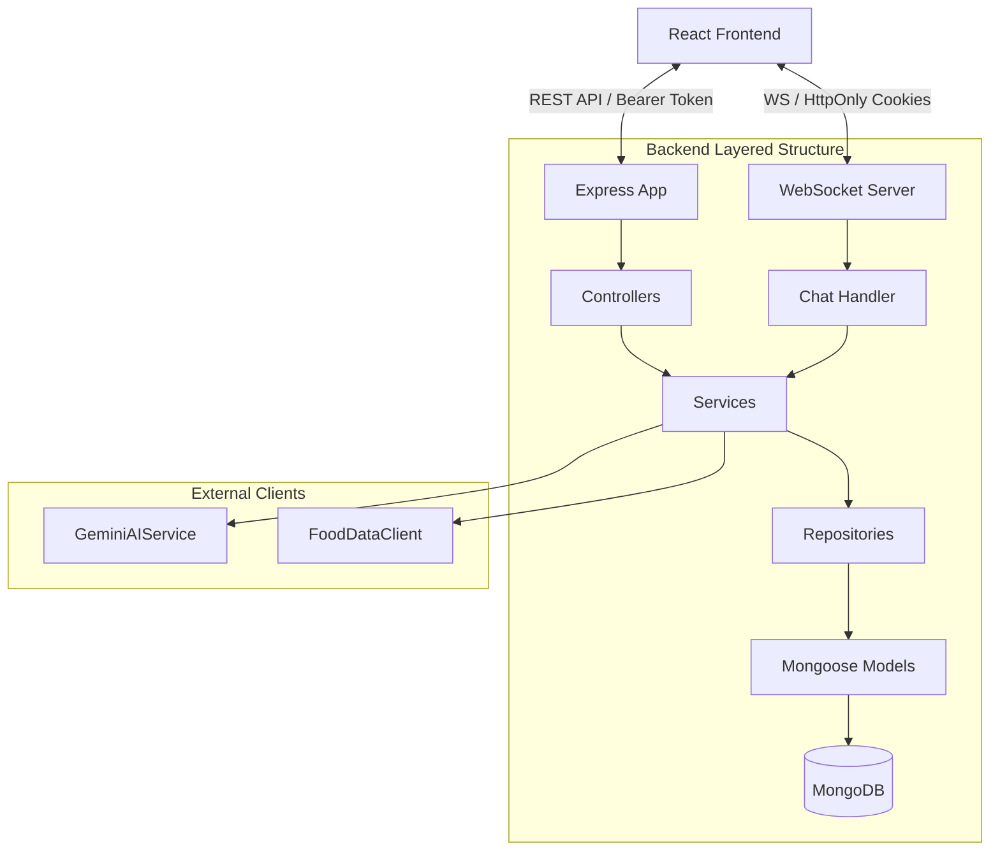

# 🥗 NutriVerse — AI-Powered Recipe & Nutrition Assistant

NutriVerse is a next-generation, full-stack recipe manager and real-time AI nutrition assistant. Built on clean, layered architecture principles with dependency injection, it automates ingredient normalization and nutritional analysis using the USDA database, offers a context-aware cooking chatbot via WebSockets, and features custom tools for meal planning, grocery list generation, and notifications.

---

## 🚀 Key Features

*   **🔮 Universal AI Recipe Generator:** Ask the Gemini AI assistant to generate *any* recipe dynamically from natural-language prompts.
*   **🍎 Automated USDA Nutrition Analysis:** Real-time extraction of ingredients and mass scaling (using the USDA FoodData Central API) to calculate exact calories, protein, carbohydrates, fats, fiber, sodium, and sugars.
*   **💬 WebSocket Cooking Assistant:** A chat window to consult with the AI chatbot about ingredients, timings, substitutions, and nutritional details.
*   **🛠️ Interactive Recipe Editor:** Edit titles, servings, cooking times, ingredients, and instructions directly inside the chat preview cards with instant macro recalculation.
*   **📅 Meal Planner & Grocery List:** Add recipes to weekly meal plans and automatically consolidate missing ingredients into a shopping checklist.
*   **🔔 Real-Time Notifications:** Dynamic notifications for updates, alerts, and recipe interactions.
*   **🔐 HttpOnly Cookie & Local Authentication:** Robust session authentication matching cookies and local Bearer headers to maintain secure access.

---

## 🏗️ Architecture & Request Flow

NutriVerse is designed using clean, decoupled layers, ensuring separate concerns and easy testing. 



### 💫 Automatic Nutrition Analysis Flow
1. **Normalization:** The raw ingredient text is normalized by `GeminiAIService` into structured JSON (quantities, names, units).
2. **USDA Search:** Ingredient names are queried against the **USDA FoodData Central API**.
3. **Density Calculation:** Calculates nutritional density per 100g and scales it according to the ingredient weight.
4. **Enrichment:** Sums the total macros and computes per-serving values before saving the recipe in MongoDB.

---

## 🛠️ Tech Stack

| Frontend | Backend | Devops / Services |
| :--- | :--- | :--- |
| React 19 & TypeScript | Node.js & Express | MongoDB & Mongoose |
| Tailwind CSS | WebSockets (`ws` library) | Redis (`ioredis` session store) |
| Redux Toolkit & React Query | Google Gemini AI SDK | Jest & `ts-jest` |
| Axios | Zod Schema Validation | Winston Logger |

---

## ⚙️ Project Structure

```text
NutriVerse/
├── backend/
│   ├── src/
│   │   ├── config/          # Configurations (DB, env, Redis, logging)
│   │   ├── controllers/     # API request entrypoints
│   │   ├── dtos/            # Data Transfer Objects
│   │   ├── interface/       # Service/Repository interface contracts
│   │   ├── middlewares/     # Auth, error handling, input validation
│   │   ├── models/          # Mongoose DB schemas
│   │   ├── repository/      # DB persistence layer
│   │   ├── routes/          # Express route bindings
│   │   ├── services/        # Business logic (Gemini, USDA, Nutrition)
│   │   └── websocket/       # WebSocket server & chat handler
│   └── tests/               # Backend testing suites
└── frontend/
    ├── src/
    │   ├── assets/          # Static assets & graphics
    │   ├── componets/       # Reusable components (buttons, headers)
    │   ├── hooks/           # Custom React hooks (auth, theme)
    │   ├── layout/          # Layout wrappers
    │   ├── pages/           # Page routes (Chat, Dashboard, Recipes)
    │   ├── services/        # API request services (Axios wrappers)
    │   ├── store/           # Redux state slices
    │   └── validation/      # Client-side form validations
```

---

## 🚀 Getting Started

### 📋 Prerequisites
Ensure you have the following installed on your local machine:
*   [Node.js](https://nodejs.org) (v18+)
*   [MongoDB](https://www.mongodb.com/try/download/community) (running locally on port `27017` or Atlas)
*   [Redis Server](https://redis.io/docs/install/) (running on port `6379`)

### 1. Environment Configurations

#### Backend Setup
Create a `.env` file in the `backend/` directory based on [backend/.env.example](file:///c:/Users/USER/Desktop/NutriVerse/backend/.env.example):
```env
NODE_ENV=development
PORT=5000
MONGO_URI=mongodb://localhost:27017/nutriverse
ACCESS_TOKEN_SECRET=your_secret_access_token_jwt
REFRESH_TOKEN_SECRET=your_secret_refresh_token_jwt
FRONTEND_URL=http://localhost:5174
REDIS_URL=redis://127.0.0.1:6379

# API Keys
GEMINI_API_KEY=your_gemini_api_key_here
FOOD_DATA_API_KEY=your_usda_api_key_here
RECIPE_IMAGE_API_KEY=your_unsplash_access_key
```

#### Frontend Setup
Create a `.env` file in the `frontend/` directory based on [frontend/.env.example](file:///c:/Users/USER/Desktop/NutriVerse/frontend/.env.example):
```env
VITE_BACKEND_URL=http://localhost:5000
```

---

### 2. Installation & Running

#### Setup and Run the Backend
```bash
cd backend
npm install
npm run dev
```

#### Setup and Run the Frontend
```bash
cd frontend
npm install --legacy-peer-deps
npm run dev
```

The frontend will run at `http://localhost:5174` and connect automatically to the backend WebSocket/REST server.

---

### 🧪 Running Tests
Verify business calculations, nutrition logic, and API mapping using the test suite:
```bash
cd backend
npm test
```

---

## 👤 Author
*   **Marwan Shafi**
    *   GitHub: [@marwaaann](https://github.com/marwaaann)
    *   Email: [2004marwanshafi@gmail.com](mailto:2004marwanshafi@gmail.com)